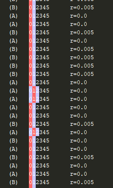
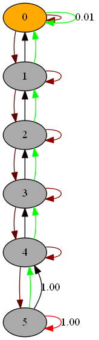
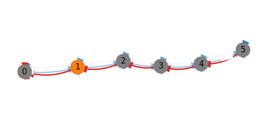

Article Companion for the paper

Maillard, Odalric-Ambrym and Bourel, Hippolyte and Talebi, Mohammad Sadegh, "Tightening Exploration in Upper Confidence Reinforcement Learning", 
International Conference on Machine Learning, 2020.

Rendering examples of River Swim environment:

| Screenshot | Rendering type |
| ------ | ------ |
|   |  Text rendering |
|   |  Pydot rendering |
|   |    Pylab rendering |

 

